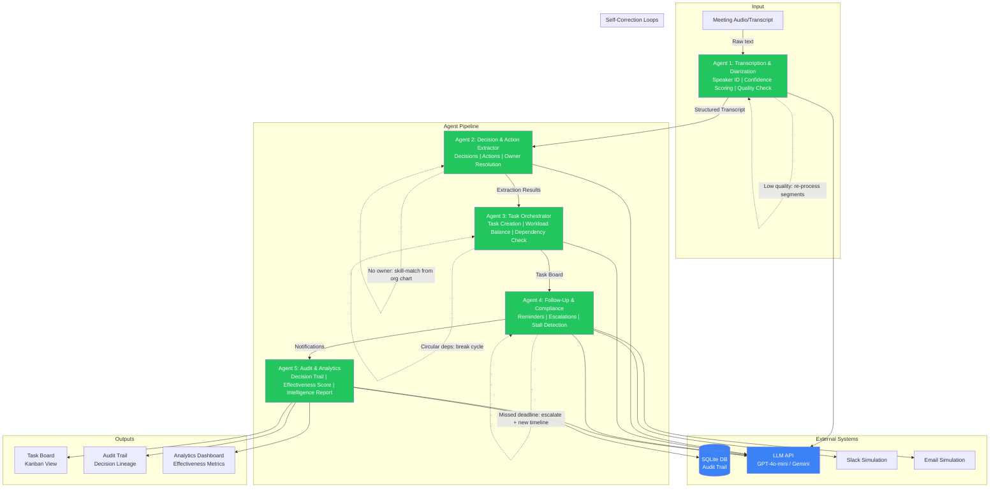

# FlowPilot Architecture

## System Overview

FlowPilot is a multi-agent AI system that transforms meeting transcripts into tracked, accountable action items with full audit trails. Five specialized agents operate in a sequential pipeline with self-correction feedback loops at every stage.

## Architecture Diagram

## Agent Details

### Agent 1: Transcription & Diarization
- **Input:** Raw meeting text or audio transcript
- **Output:** Structured segments with speaker tags, timestamps, confidence scores
- **Self-Correction:** Re-processes low-confidence segments (< 0.7); falls back to rule-based parsing if LLM fails
- **Failure Modes:** Garbled audio, overlapping speakers, unknown participants

### Agent 2: Decision & Action Extractor
- **Input:** Structured transcript from Agent 1
- **Output:** Decisions, action items with owners/deadlines, ambiguity flags
- **Self-Correction:** Resolves missing owners via org chart skill-matching; converts vague deadlines to concrete dates based on priority
- **Failure Modes:** Passive voice ownership, implicit actions, conflicting statements

### Agent 3: Task Orchestrator
- **Input:** Action items from Agent 2
- **Output:** Task board with assignments, priorities, dependencies
- **Self-Correction:** Detects overloaded team members (>110% capacity) and redistributes; breaks circular dependency chains; extends infeasible deadlines with buffer
- **Failure Modes:** Impossible deadlines, resource conflicts, missing dependencies

### Agent 4: Follow-Up & Compliance
- **Input:** Task board from Agent 3
- **Output:** Notifications (Slack/email), escalations, stall alerts
- **Self-Correction:** Escalates unassigned tasks to managers; detects missed deadlines and proposes new timelines; identifies stalled tasks and triggers re-routing
- **Failure Modes:** Unresponsive assignees, cascading delays, SLA breaches

### Agent 5: Audit & Analytics
- **Input:** Full pipeline state
- **Output:** Persistent audit trail, meeting effectiveness score, intelligence report
- **Self-Correction:** Validates data completeness before persistence; flags gaps in audit trail
- **Failure Modes:** Incomplete data from upstream agents, database write failures

## Communication Protocol

Agents communicate via a shared `PipelineState` object passed sequentially. Each agent reads from and writes to this state, ensuring:
- **Immutable input:** Agents don't modify upstream data
- **Append-only audit:** Corrections and events are only added, never deleted
- **Error isolation:** Agent failures are caught and logged without crashing the pipeline

## Error Recovery Strategy

1. **Retry:** LLM calls retry 3x with exponential backoff
2. **Fallback:** If LLM fails, rule-based parsing takes over
3. **Skip:** Non-critical agents (Follow-Up, Audit) can be skipped without aborting
4. **Escalate:** Unresolvable issues are flagged for human review
5. **Human-in-the-Loop:** Ambiguities are surfaced in the dashboard for manual resolution

## Technology Stack

| Component | Technology | Justification |
|-----------|-----------|---------------|
| Backend | FastAPI (Python) | Async, fast, auto-docs, Pydantic integration |
| LLM | GPT-4o-mini / Gemini 2.0 Flash | Cost-effective, fast inference, good structured output |
| Database | SQLite | Zero setup, portable, sufficient for demo scale |
| Frontend | React + Tailwind CSS | Modern, responsive, component-based |
| Real-time | WebSockets | Live pipeline updates without polling |

## Scalability Path

- **Horizontal:** Agent pipeline can be distributed across workers via message queue (Redis/RabbitMQ)
- **LLM:** Swap to dedicated fine-tuned models for each agent to reduce latency and cost
- **Storage:** Migrate SQLite to PostgreSQL for production; add vector store for semantic search across meetings
- **Integrations:** Plugin architecture for real Jira, Asana, Slack, Google Calendar connections
